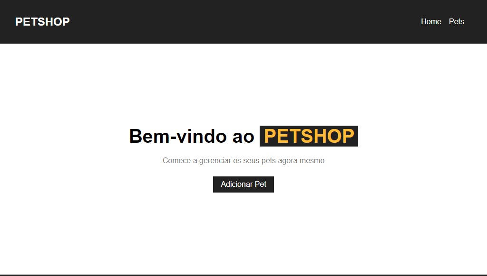
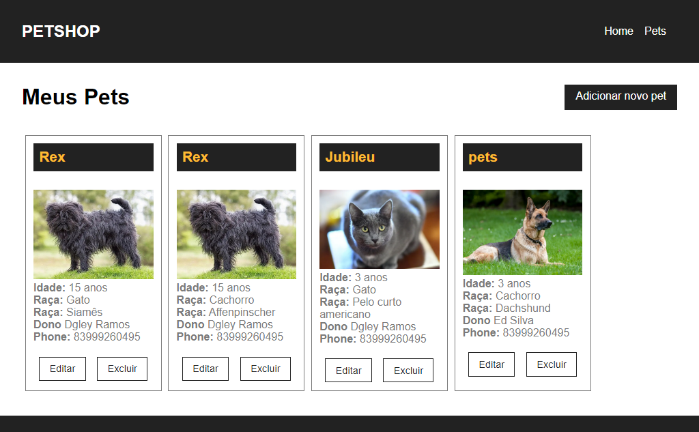

<h1 align="center">PETSHOP</h1>

<p align="center">Projeto desenvolvido para listar animais de estimação de uma petshop</p>


<h3 align="center">Sobre</h3>

<p align="center">Aplicação criada para solucionar desafio proposto como parte do processo seletivo, criar aplicação fullstack que liste, crie, atualize e delete animais de uma petshop</p>






### Features

- [x] Cadastro de Pet
- [x] Atualização de Pet
- [x] Buscar Pet pelo ID
- [x] Buscar todos os Pets
- [x] Remover Pet

 Rodando o Back End 

```bash
# Clone este repositório
$ git clone <https://github.com/te05571/health-desafio-desenvolvedor-junior-2>

# Acesse a pasta do projeto no terminal/cmd
$ cd health-desafio-desenvolvedor-junior-2

# Instale as dependências
$ yarn install

# Execute a aplicação em modo de desenvolvimento
$ yarn api

# O servidor inciará na porta: 3333 - acesse <http://localhost:3001>

# É importante alterar as variaveis de ambiente para fazer a conexão com o banco de dados
# Crie o arquivo .env na rqaiz do seu projeto e coloque as seguintes linhas com as credencias do seu banco de dados
$ DB_HOST = <nomoe-do-host>
$ DB_PORT = <porta>
$ DB_NAME = <nome-do-banco>
$ DB_USER = <usuario>
$ DB_PASS = <senha>

# Aqui é a parta onde você deseja subir sua aplicação local
$ PORT=3333

# Gere as migrações de suas tabelas para o seu banco de dados
$ yarn migration:generate

# Agora rode essas migrações para que as tabelas sejam criadas no banco de dados
$ yarn migration:run
```


#### **Dependências**  ([NodeJS](https://nodejs.org/en/)  +  [TypeScript](https://www.typescriptlang.org/))

-   **dotenv**
-   **express**
-   **pg**
-   **reflect-metadata**
-   **rimraf**
-   **typeorm**
-   **uuid**


#### **Endpoints**

```bash
# GET -> Pega todos os animais cadastrados
$ /api/pets

# GET -> Pega somente um animal, se ele estiver cadastrado. Passando o ID como parâmetro
$ /api/pets/:id

# POST -> Cadastra animal
$ /api/pets

# PUT -> Atualiza animal no banco de dados. Passando o ID como parâmetro
$ /api/pets/:id

# DELETE -> Apaga animal do banco de dados. Passando o ID como parâmetro
$ /api/pets/:id

```

#### **Model**

##### Modelo de Pet:
-   **id** -> dado é gerado automaticamente pela dependência uuid
-	**name**
-	**age**
-	**tipo**
-	**raca**
-	**imagem** -> link da imagem
-	**owner**
-	**phone**


Rodando o Front End

<h4 align="center"> 
	
</h4>

```bash
# É preciso acessar a pasta do projeto no terminal/cmd
$ cd client

# Instale as dependências
$ yarn install

# Execute a aplicação em modo de desenvolvimento
$ yarn start

# O servidor inciará na porta: 3333 - acesse <http://localhost:3000>

```


#### **Dependências**  ([React.Js](https://pt-br.reactjs.org/))

-   **web-vitals**
-   **react-scripts**
-   **react-router-dom**
-   **react-dom**


#### **Endpoints**

```bash
# Página inical da aplicação
$ /

# Página onde é mostrada todos os pets
$ /pets

# Apresenta os dados de um pet com o id do parâmetro
$ /pets/:id

# Página com formulário para cadastro de novos pets
$ /novo
```
## Author
Victor Samuel
[LinkedIn](https://www.linkedin.com/in/dgleyramos/](https://www.linkedin.com/in/victor-samuel-34939a1b9)

<p><a href="[https://www.buymeacoffee.com/dgleyramos](https://www.linkedin.com/in/victor-samuel-34939a1b9/)"> </a></p><br><br>


